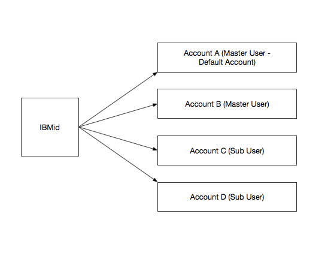

---

copyright:

  years: 1994, 2019

lastupdated: "2019-01-31"

---

{:shortdesc: .shortdesc}
{:screen: .screen}
{:tip: .tip}
{:codeblock: .codeblock}
{:pre: .pre}
{:new_window: target="_blank"}

# Using IBMid accounts with {{site.data.keyword.BluSoftlayer_notm}} infrastructure
{: #customerportal_ibmid}

Authentication in {{site.data.keyword.BluSoftlayer_notm}} infrastructure now uses IBMid to provide a single login for {{site.data.keyword.Bluemix_notm}}.
{:shortdesc}

If you have an existing SoftLayer account, you can switch to an IBMid. A migration wizard can help guide you through this switch. For more information, see [Switching to IBMid](/docs/account?topic=account-switchtoIBMid#switchtoIBMid).

## Mapping multiple SoftLayer accounts to one IBMid
{: #cp_mapmultclinfrto1ibmid}

You can associate one IBMid with multiple SoftLayer accounts by using an existing IBMid email address when you set up the account. Only one {{site.data.keyword.BluSoftlayer_notm}} infrastructure user for each account can be mapped to the single IBMid. The IBMid must be unique within each SoftLayer account. However, one user with access to multiple SoftLayer accounts can use one IBMid to access multiple SoftLayer accounts.

For example, an IBMid can map to the master user in accounts A and B, and to another user in accounts C and D. One of the accounts that is mapped to that IBMid is the default account. Usually, the default account is the account that was first mapped to the IBMid. You can switch which account is the default account by using a feature in the customer portal to switch accounts.

For a user with IBMid access to multiple accounts with two-factor authentication enabled, a two-factored authentication verification code is required. The verification code is required, per account, during account login and when you switch the default account.
